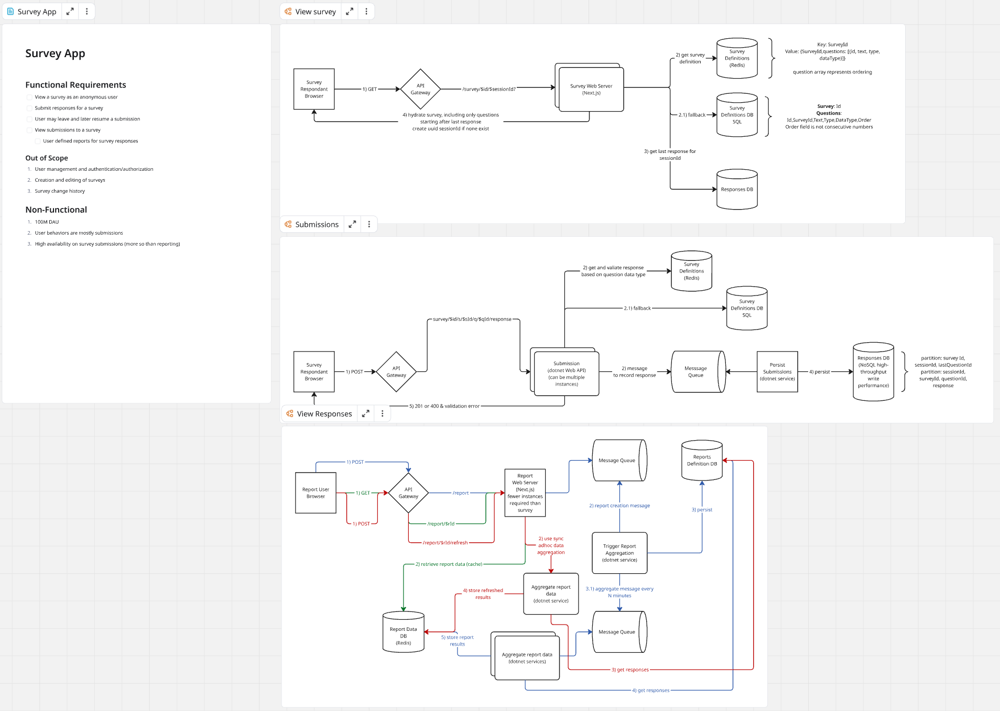

## Overview

Some companies specify using a specific diagramming tool, but many allow you to bring your own. I tried several, including Whimsical, Zoom's whiteboard, and a few others, but ultimately landed on [Miro](https://miro.com/). Here's why.

## Why Miro

Firstly, I paid for a subscription. This unlocked most if not all features. It also allowed to me to share a private session with interviewers where they could go back after the interview and see our work.

One nice thing about Miro, is the ability to easily add markdown documents, along with syntax highlighted code snippets. Additionally, I typically used a board for each interview. This provides me a single visual space for multiple discreet diagrams/documents. Each one can be set to be the full screen. This allows you to zoom in and out of many diagrams that are collectively used to tell the entire story for a system. Here is an [example of a practice problem, a Survey application](https://miro.com/app/board/uXjVJb8EqmE=/?share_link_id=936851846508) that uses these concepts. Notice I have a markdown document where I can capture requirements, clarifications, etc. to be used for the interview. This is where I begin the problem.

I like using a single diagram for a single flow through the system. This can help highlight interactions for that flow without overloading with unrelated items for other parts of the system. For the next flow, I like to copy the first and then add to it. Although this could capture unrelated items from the first flow, these can easily be ignored because you will be talking through the active flow with the interviewer. The remaining parts are simply the background of the system as already described. I normally do this for all of the relevant flows; usually only 3 or so. The final flow, will contain the final flow, plus all other flows (given it was copied from the previous step). Of course, if any one item is in the way of telling the story in a meaningful way in a give step (flow), then I may opt ot remove it just to improve overall clarity.

## Perfect Practice

Ensure you practice with the tool, whatever you land on or are forced to use prior to the interview. The tool should work for you, not against you. Additionally, you should practice these problems by talking through your process, out loud. Articulating your design in a logical and well though out manner, while you are creating it, all within a 45 minute time window, is a skill that must be practiced just like the actual designing of the system.
